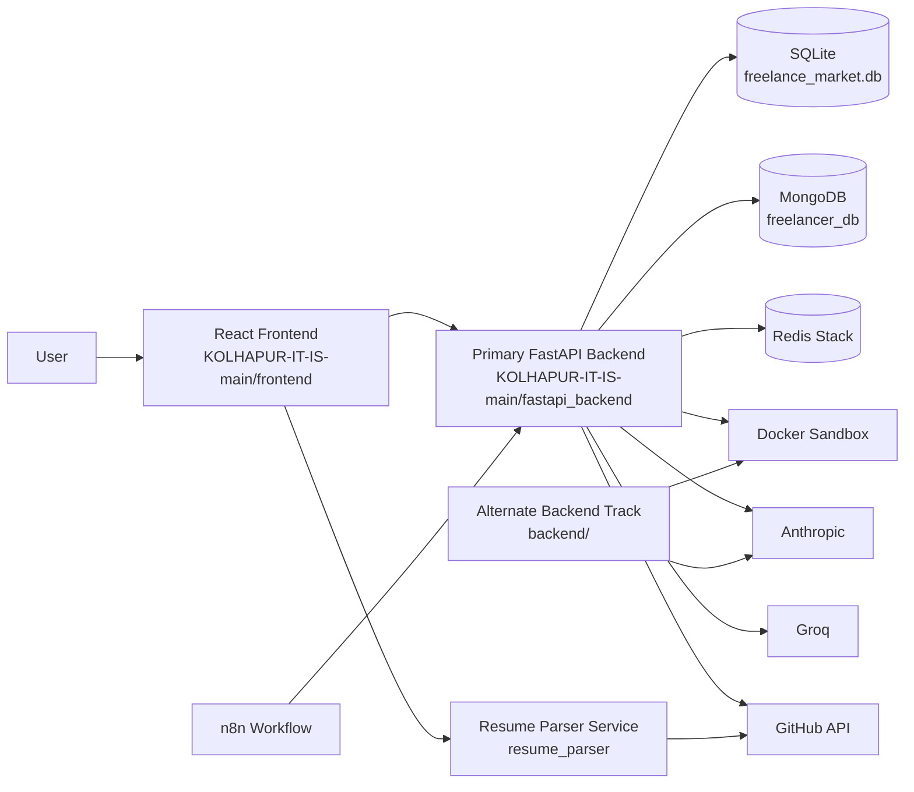
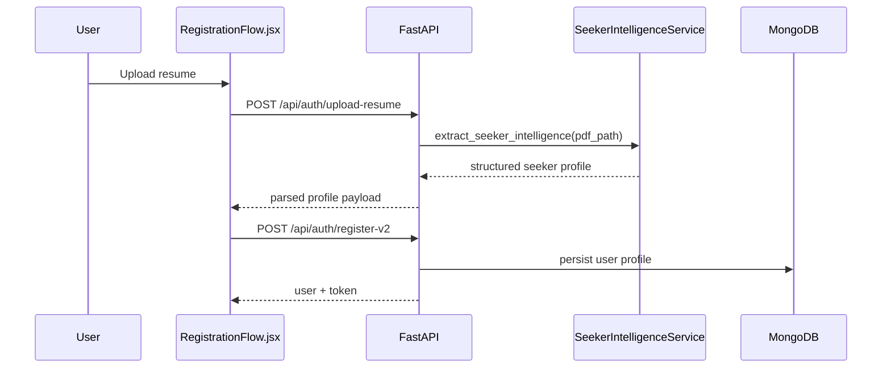
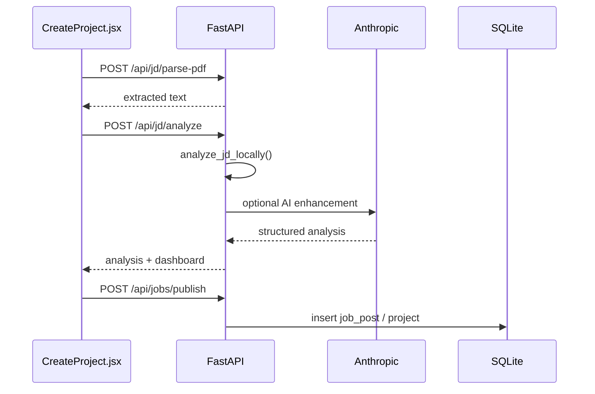
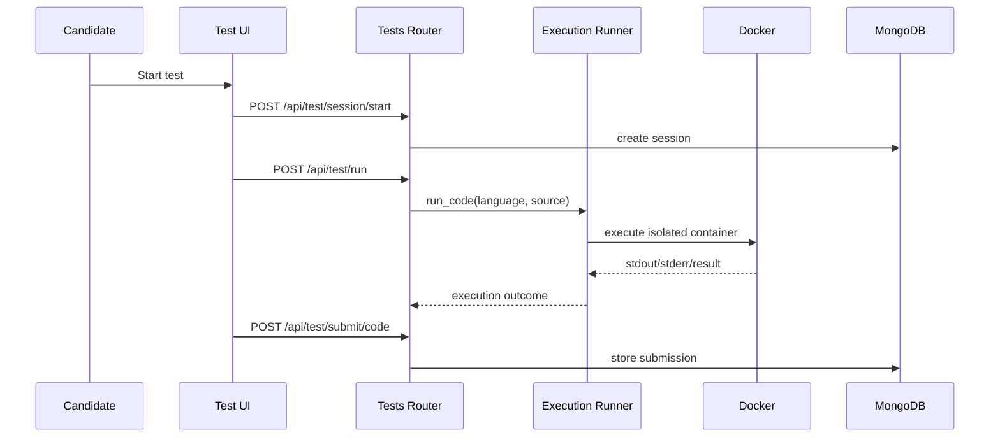
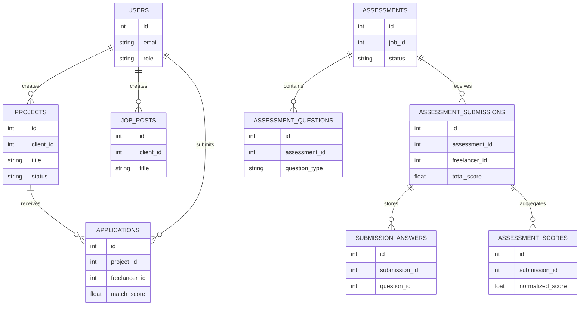
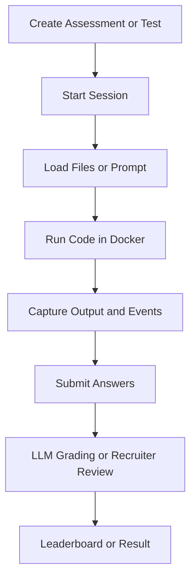

# Architect-X Hiring & Freelance Intelligence Platform

     

> A multi-service AI hiring workspace that combines freelancer onboarding, job-post intelligence, resume parsing, code assessments, recruiter dashboards, and real-time hiring signals.

## Table of Contents
- [1. Overview](#1-overview)
- [2. Key Features](#2-key-features)
- [3. System Architecture](#3-system-architecture)
- [4. Tech Stack](#4-tech-stack)
- [5. Project Structure](#5-project-structure)
- [6. Core Modules & Logic](#6-core-modules--logic)
- [7. Database Schema](#7-database-schema)
- [8. API Reference](#8-api-reference)
- [9. AI / ML Pipeline](#9-ai--ml-pipeline)
- [10. VM Management](#10-vm-management)
- [11. JD Processing](#11-jd-processing)
- [12. Authentication & Authorization](#12-authentication--authorization)
- [13. Environment Variables](#13-environment-variables)
- [14. Getting Started](#14-getting-started)
- [15. Testing](#15-testing)
- [16. Deployment](#16-deployment)
- [17. Known Limitations & TODOs](#17-known-limitations--todos)
- [18. Contributing](#18-contributing)
- [19. License](#19-license)

---

## 1. Overview

This repository is not a single narrow app. It is a hiring platform workspace with several overlapping implementation tracks:

1. The primary runnable stack lives under [`KOLHAPUR-IT-IS-main/frontend`](./KOLHAPUR-IT-IS-main/frontend) and [`KOLHAPUR-IT-IS-main/fastapi_backend`](./KOLHAPUR-IT-IS-main/fastapi_backend). This is the stack most clearly wired together today.
2. A standalone resume intelligence microservice lives under [`KOLHAPUR-IT-IS-main/resume_parser`](./KOLHAPUR-IT-IS-main/resume_parser).
3. A browser-only AI analysis demo lives under [`KOLHAPUR-IT-IS-main/ai-job-analyzer`](./KOLHAPUR-IT-IS-main/ai-job-analyzer).
4. A second, more infrastructure-heavy backend prototype lives under [`backend`](./backend). It contains a different schema and service model, including PostgreSQL/pgvector and Docker-backed VM workflows, but it is not the backend the current React app is primarily targeting.

At a business level, the system solves three related problems:

- It helps recruiters and clients create better job briefs and shortlist talent faster.
- It helps freelancers or job seekers register, upload resumes, see AI-matched roles, and complete technical assessments.
- It provides engineering hooks for AI analysis, vector search, GitHub enrichment, OTP flows, real-time events, and recruiter-facing dashboards.

From end to end, the primary flow is:

1. A seeker uploads a resume through the React frontend.
2. The FastAPI backend parses and normalizes the resume, stores profile data, and computes seeker intelligence.
3. A client creates a project or job brief using an AI-assisted workflow.
4. The backend analyzes the JD, computes fit signals, persists jobs/projects, and exposes them to dashboards and job discovery screens.
5. Candidates apply, recruiters review applications and dashboards, and technical tests or VM-style assessments can be assigned and graded.

---

## 2. Key Features

- Resume upload and seeker registration flow in [`src/pages/RegistrationFlow.jsx`](./KOLHAPUR-IT-IS-main/frontend/src/pages/RegistrationFlow.jsx)
- OTP-based auth endpoints in [`fastapi_backend/routes/auth.py`](./KOLHAPUR-IT-IS-main/fastapi_backend/routes/auth.py)
- Session-token based frontend auth state in [`src/context/AuthContext.jsx`](./KOLHAPUR-IT-IS-main/frontend/src/context/AuthContext.jsx)
- AI-assisted project and JD builder in [`src/pages/CreateProject.jsx`](./KOLHAPUR-IT-IS-main/frontend/src/pages/CreateProject.jsx)
- PDF JD parsing endpoint `/api/jd/parse-pdf` implemented in [`fastapi_backend/main.py`](./KOLHAPUR-IT-IS-main/fastapi_backend/main.py)
- Local plus LLM JD analysis using `sanitize_jd_text()`, `analyze_jd_locally()`, and `analyze_jd_with_ai_or_fallback()` in [`fastapi_backend/main.py`](./KOLHAPUR-IT-IS-main/fastapi_backend/main.py)
- Skills graph and dashboard compilation via `build_skill_graph()` and `compile_dashboard()`
- Freelancer project marketplace CRUD in [`fastapi_backend/routes/projects.py`](./KOLHAPUR-IT-IS-main/fastapi_backend/routes/projects.py)
- AI job discovery feed in [`src/pages/AIJobDiscovery.jsx`](./KOLHAPUR-IT-IS-main/frontend/src/pages/AIJobDiscovery.jsx)
- Match score and gap analysis via `calculate_match_score()` and `calculate_gaps()` in [`fastapi_backend/main.py`](./KOLHAPUR-IT-IS-main/fastapi_backend/main.py)
- Seeker intelligence extraction, skill normalization, persona inference, and GitHub analysis in [`fastapi_backend/services/seeker_intelligence.py`](./KOLHAPUR-IT-IS-main/fastapi_backend/services/seeker_intelligence.py)
- Client dashboards and application review APIs in [`fastapi_backend/routes/talent_intelligence.py`](./KOLHAPUR-IT-IS-main/fastapi_backend/routes/talent_intelligence.py)
- Mongo-backed coding test engine in [`fastapi_backend/routes/tests.py`](./KOLHAPUR-IT-IS-main/fastapi_backend/routes/tests.py)
- Docker-sandboxed code execution in [`fastapi_backend/services/execution_runner.py`](./KOLHAPUR-IT-IS-main/fastapi_backend/services/execution_runner.py)
- VM-style assessment creation, submission, grading, and leaderboard APIs in [`fastapi_backend/routes/assessments.py`](./KOLHAPUR-IT-IS-main/fastapi_backend/routes/assessments.py)
- LLM-assisted grading and percentile ranking in [`fastapi_backend/services/grading_service.py`](./KOLHAPUR-IT-IS-main/fastapi_backend/services/grading_service.py)
- WebSocket realtime channel and missed-event replay in [`fastapi_backend/main.py`](./KOLHAPUR-IT-IS-main/fastapi_backend/main.py) and [`src/services/realtime.js`](./KOLHAPUR-IT-IS-main/frontend/src/services/realtime.js)
- MongoDB change-stream support in [`fastapi_backend/mongodb_realtime.py`](./KOLHAPUR-IT-IS-main/fastapi_backend/mongodb_realtime.py)
- n8n workflow for resume ingestion and OpenAI parsing in [`KOLHAPUR-IT-IS-main/workflow.json`](./KOLHAPUR-IT-IS-main/workflow.json)
- Standalone resume parser and GitHub enrichment service in [`KOLHAPUR-IT-IS-main/resume_parser`](./KOLHAPUR-IT-IS-main/resume_parser)
- Experimental alternate backend with PostgreSQL, pgvector, Anthropic chat, and Docker VM sessions in [`backend`](./backend)
- Redis vector indexing and embedding seed scripts in [`scripts/init_vector_index.py`](./scripts/init_vector_index.py), [`scripts/embedding_pipeline.py`](./scripts/embedding_pipeline.py), and [`scripts/seed_database.py`](./scripts/seed_database.py)

---

## 3. System Architecture

The repo currently has a hub-and-spoke architecture with one main app path and several sidecar services.

- The React frontend calls the primary FastAPI backend through `/api/*`.
- The primary backend is hybrid persistence: SQLite for transactional app data plus MongoDB for seeker intelligence, tests, notifications, OTP, and VM assessment artifacts.
- Redis is optional in the primary backend today, but the repo also includes vector-index tooling that expects Redis Stack / RediSearch.
- Docker is used for code execution sandboxes and VM-like assessment runtimes.
- n8n can orchestrate resume parsing via webhook and forward structured output back to FastAPI.
- The `resume_parser` service is a standalone enrichment API, not just an internal module.
- The top-level `backend/` folder represents a separate next-gen backend direction with PostgreSQL/pgvector and more explicit domain models.



### Architecture notes

- `frontend` is a Vite SPA with a single API client surface in [`src/services/api.js`](./KOLHAPUR-IT-IS-main/frontend/src/services/api.js).
- `fastapi_backend/main.py` mixes router registration with substantial endpoint logic directly in the app file.
- `fastapi_backend/database.py` initializes both SQLite tables and Mongo indexes.
- `fastapi_backend/services/seeker_intelligence.py` contains much of the platform-specific intelligence logic rather than a thin AI wrapper.
- `backend/` should be treated as a parallel implementation track, not the source of truth for the frontend contracts.

---

## 4. Tech Stack

| Layer | Technology | Version | Purpose |
|---|---|---:|---|
| Frontend | React | 18.3.1 | SPA UI |
| Frontend Build | Vite | 6.0.5 | Dev server and bundling |
| Frontend Routing | react-router-dom | 7.13.2 | Client-side routing |
| Frontend Animations | framer-motion | 12.38.0 | Motion and transitions |
| Frontend Charts | recharts | 3.8.1 | Dashboard visualizations |
| Frontend Icons | lucide-react | 1.6.0 | UI iconography |
| Frontend Styling | Tailwind CSS | 4.2.2 | Utility-first styling |
| Primary Backend | FastAPI | requirements-based | Main API server |
| ASGI Server | Uvicorn | requirements-based | API serving |
| ORM / SQL | sqlite3 + SQLAlchemy in alt stack | built-in / requirements-based | SQLite in primary stack, SQLAlchemy in alternate backend |
| NoSQL | MongoDB | 8.0 image in compose | OTP, seeker intelligence, tests, notifications, VM artifacts |
| Cache / Search | Redis Stack | 7.2.0-v20 image | Cache, vector indexing, RediSearch |
| Realtime | WebSockets + Mongo change streams | app-defined | Live sync and missed-event replay |
| Scheduling | APScheduler | requirements-based | Deferred grading jobs |
| AI / LLM | Anthropic | env-driven | JD analysis and alternate backend VM postmortems |
| AI / LLM | Groq | env-driven | Assessment grading in primary stack |
| Embeddings | sentence-transformers | requirements-based | Text embeddings for seed/vector tools |
| PDF Parsing | pdfplumber / PyPDF2 / pypdf | requirements-based | Resume and JD PDF extraction |
| Containers | Docker | host dependency | Code execution and VM-like sessions |
| Workflow Automation | n8n | latest image | Resume parse workflow orchestration |
| GitHub Enrichment | PyGithub | requirements-based | Candidate profile enrichment |
| Testing | pytest | requirements-based | Python tests in both backend tracks |
| Deployment Infra | Docker Compose | compose file | Local infra bootstrap |

---

## 5. Project Structure

The tree below focuses on meaningful source and config paths. Generated directories such as `node_modules`, `dist`, `venv`, `__pycache__`, and IDE metadata are omitted for readability.

```text
.
├── README.md
├── docker-compose.yml
├── scripts/
│   ├── download_datasets.py          # Kaggle dataset bootstrap
│   ├── embedding_pipeline.py         # SentenceTransformer embedding pipeline
│   ├── init_vector_index.py          # Redis vector index creation
│   ├── seed_database.py              # Mongo + Redis sample data seed
│   ├── start-services.ps1            # Windows service bootstrap helper
│   └── stop-services.ps1             # Windows service shutdown helper
├── backend/                          # Alternate backend track
│   ├── .env.example
│   ├── Dockerfile
│   ├── requirements.txt
│   ├── main.py                       # Mongo/Redis-oriented API entrypoint
│   ├── main_new.py                   # Newer SQLAlchemy entrypoint
│   ├── config.py
│   ├── database.py
│   ├── database_new.py
│   ├── alembic/
│   │   ├── env.py
│   │   └── versions/001_initial_schema.py
│   ├── models/
│   ├── routes/
│   ├── services/
│   └── tests/
└── KOLHAPUR-IT-IS-main/
    ├── START_HERE.md
    ├── SERVICES_AND_COMMANDS.md
    ├── API_ENDPOINTS.md              # Legacy docs, partially stale
    ├── DATABASE_SCHEMA.md            # Legacy docs, partially stale
    ├── workflow.json                 # n8n resume parsing workflow
    ├── frontend/
    │   ├── package.json
    │   ├── vite.config.js
    │   ├── tailwind.config.js
    │   ├── src/
    │   │   ├── App.jsx
    │   │   ├── api/config.js
    │   │   ├── context/AuthContext.jsx
    │   │   ├── services/api.js
    │   │   ├── services/realtime.js
    │   │   ├── utils/normalizeSkills.js
    │   │   ├── components/
    │   │   └── pages/
    │   └── public/
    ├── fastapi_backend/
    │   ├── main.py
    │   ├── database.py
    │   ├── mongodb_realtime.py
    │   ├── email_service.py
    │   ├── routes/
    │   │   ├── auth.py
    │   │   ├── notifications.py
    │   │   ├── projects.py
    │   │   ├── stats.py
    │   │   ├── talent_intelligence.py
    │   │   ├── tests.py
    │   │   └── assessments.py
    │   ├── services/
    │   │   ├── execution_runner.py
    │   │   ├── grading_service.py
    │   │   ├── scheduler.py
    │   │   └── seeker_intelligence.py
    │   └── uploads/
    ├── resume_parser/
    │   ├── README.md
    │   ├── requirements.txt
    │   ├── main.py
    │   ├── models.py
    │   ├── database.py
    │   └── services/
    │       ├── github_service.py
    │       └── resume_service.py
    └── ai-job-analyzer/
        ├── index.html
        ├── app.js
        └── styles.css
```

### Important files to understand first

- [`KOLHAPUR-IT-IS-main/frontend/src/services/api.js`](./KOLHAPUR-IT-IS-main/frontend/src/services/api.js): the clearest map of frontend expectations
- [`KOLHAPUR-IT-IS-main/fastapi_backend/main.py`](./KOLHAPUR-IT-IS-main/fastapi_backend/main.py): primary API composition plus many inline endpoints
- [`KOLHAPUR-IT-IS-main/fastapi_backend/database.py`](./KOLHAPUR-IT-IS-main/fastapi_backend/database.py): actual runtime schema bootstrap
- [`KOLHAPUR-IT-IS-main/fastapi_backend/services/seeker_intelligence.py`](./KOLHAPUR-IT-IS-main/fastapi_backend/services/seeker_intelligence.py): domain-specific AI logic
- [`backend/alembic/versions/001_initial_schema.py`](./backend/alembic/versions/001_initial_schema.py): alternate backend relational schema

---

## 6. Core Modules & Logic

### Resume Registration & Seeker Intelligence

What it does:
Transforms a raw seeker registration into a structured profile with skills, confidence, inferred persona, education, projects, experience, and GitHub-aware intelligence.

How it works:
1. The frontend flow in `RegistrationFlow.jsx` uploads a PDF through `authAPI.uploadResume()`.
2. The backend endpoint `/api/auth/upload-resume` in `routes/talent_intelligence.py` stores the file and calls `extract_seeker_intelligence()` from `SeekerIntelligenceService`.
3. `SeekerIntelligenceService` extracts text with `pdfplumber`, parses profile signals, normalizes skills, and computes match-ready data.
4. The frontend submits enriched registration payloads through `/api/auth/register-v2`.
5. The user profile is written into Mongo and normalized for the React auth context.

Key files:
- [`frontend/src/pages/RegistrationFlow.jsx`](./KOLHAPUR-IT-IS-main/frontend/src/pages/RegistrationFlow.jsx)
- [`frontend/src/services/api.js`](./KOLHAPUR-IT-IS-main/frontend/src/services/api.js)
- [`fastapi_backend/routes/talent_intelligence.py`](./KOLHAPUR-IT-IS-main/fastapi_backend/routes/talent_intelligence.py)
- [`fastapi_backend/services/seeker_intelligence.py`](./KOLHAPUR-IT-IS-main/fastapi_backend/services/seeker_intelligence.py)

Key functions:
- `extract_seeker_intelligence()`
- `_extract_skills()`
- `_infer_persona()`
- `calculate_match_score()`



Edge cases handled:
- Missing or low-confidence resume sections
- Skill alias normalization
- Partial contact extraction
- Empty GitHub signal
- Resume parsing fallback when LLM services are unavailable

### JD Builder, Parsing, and AI Job Publishing

What it does:
Lets clients create high-quality job briefs from text or PDF, analyze them, and publish normalized job posts.

How it works:
1. `CreateProject.jsx` collects title, mode, budget, skills, and optionally a PDF JD.
2. `/api/autocomplete/titles` provides title suggestions.
3. `/api/jd/parse-pdf` extracts text from uploaded PDF.
4. `/api/jd/analyze` runs local heuristics and optional Anthropic augmentation through `analyze_jd_with_ai_or_fallback()`.
5. `/api/jd/compile` and `/api/jobs/publish` build recruiter-facing dashboards and persist job or project data.

Key files:
- [`frontend/src/pages/CreateProject.jsx`](./KOLHAPUR-IT-IS-main/frontend/src/pages/CreateProject.jsx)
- [`fastapi_backend/main.py`](./KOLHAPUR-IT-IS-main/fastapi_backend/main.py)

Key functions:
- `sanitize_jd_text()`
- `analyze_jd_locally()`
- `_call_anthropic_blocking()`
- `analyze_jd_with_ai_or_fallback()`
- `build_skill_graph()`
- `compile_dashboard()`



Edge cases handled:
- Unparseable PDF
- Empty JD text
- Missing Anthropic API key
- Local fallback scoring when external LLM calls fail

### Marketplace Projects & Applications

What it does:
Supports posting projects, browsing them, applying as a freelancer, and reviewing applications as a client.

How it works:
1. `projects_router` manages project CRUD in SQLite.
2. `talent_intelligence.py` exposes `/apply`, `/hire`, `/rate`, `/payments`, and client dashboard endpoints.
3. `apply_to_project()` computes `match_data` using seeker intelligence before persisting.
4. Client dashboard endpoints join SQLite projects with Mongo application records.

Key files:
- [`fastapi_backend/routes/projects.py`](./KOLHAPUR-IT-IS-main/fastapi_backend/routes/projects.py)
- [`fastapi_backend/routes/talent_intelligence.py`](./KOLHAPUR-IT-IS-main/fastapi_backend/routes/talent_intelligence.py)
- [`frontend/src/pages/JobBrowsing.jsx`](./KOLHAPUR-IT-IS-main/frontend/src/pages/JobBrowsing.jsx)
- [`frontend/src/pages/ClientDashboard.jsx`](./KOLHAPUR-IT-IS-main/frontend/src/pages/ClientDashboard.jsx)

Edge cases handled:
- Duplicate applies
- Missing seeker profile
- Missing project records
- Mixed SQLite/Mongo application state

### Coding Tests

What it does:
Creates recruiter-managed coding tests, starts candidate sessions, executes code, captures violations, and stores submissions.

How it works:
1. Recruiters create test configs through `/api/test/create`.
2. Candidates start sessions with `/api/test/session/start`.
3. Code execution is delegated to `run_code()` in `execution_runner.py`.
4. Session snapshots and anti-cheat style violations are captured through `/api/test/session/violation` and `/api/test/session/snapshot`.
5. Final answers are written to Mongo submissions.

Key files:
- [`fastapi_backend/routes/tests.py`](./KOLHAPUR-IT-IS-main/fastapi_backend/routes/tests.py)
- [`fastapi_backend/services/execution_runner.py`](./KOLHAPUR-IT-IS-main/fastapi_backend/services/execution_runner.py)
- [`frontend/src/pages/TestPage.jsx`](./KOLHAPUR-IT-IS-main/frontend/src/pages/TestPage.jsx)
- [`frontend/src/pages/RecruiterTestManager.jsx`](./KOLHAPUR-IT-IS-main/frontend/src/pages/RecruiterTestManager.jsx)



Edge cases handled:
- Timeout execution
- Unsupported language
- Session violations
- Missing test configuration

### VM Assessments & LLM Grading

What it does:
Runs richer assessment workflows where recruiters attach codebases, candidates answer or modify files, and the platform computes scores plus leaderboards.

How it works:
1. Recruiters call `/api/v1/assessments/create`.
2. Metadata is saved in SQLite while codebase artifacts and grading summaries are stored in Mongo.
3. Candidates open `/take`, submit answers through `/submit`, and grading is scheduled by APScheduler.
4. `grading_service.py` summarizes the codebase, sends prompts to Groq, stores 0/50/100 scores, and updates percentiles.

Key files:
- [`fastapi_backend/routes/assessments.py`](./KOLHAPUR-IT-IS-main/fastapi_backend/routes/assessments.py)
- [`fastapi_backend/services/grading_service.py`](./KOLHAPUR-IT-IS-main/fastapi_backend/services/grading_service.py)
- [`fastapi_backend/services/scheduler.py`](./KOLHAPUR-IT-IS-main/fastapi_backend/services/scheduler.py)
- [`frontend/src/pages/AssessmentTake.jsx`](./KOLHAPUR-IT-IS-main/frontend/src/pages/AssessmentTake.jsx)
- [`frontend/src/pages/AssessmentCreate.jsx`](./KOLHAPUR-IT-IS-main/frontend/src/pages/AssessmentCreate.jsx)

Edge cases handled:
- Auto-submit on fullscreen exit or tab switch
- Delayed grading
- Partial codebase uploads
- Missing Groq API key fallback behavior

### Realtime Sync & Notifications

What it does:
Streams real-time platform events and supports replaying missed events after reconnect.

How it works:
1. The backend persists events in SQLite `realtime_events`.
2. `/ws` accepts websocket clients and emits live messages.
3. `/api/sync/missed` replays events since a provided timestamp.
4. `src/services/realtime.js` handles connection, heartbeats, subscriptions, and replay.

Key files:
- [`fastapi_backend/main.py`](./KOLHAPUR-IT-IS-main/fastapi_backend/main.py)
- [`fastapi_backend/mongodb_realtime.py`](./KOLHAPUR-IT-IS-main/fastapi_backend/mongodb_realtime.py)
- [`frontend/src/services/realtime.js`](./KOLHAPUR-IT-IS-main/frontend/src/services/realtime.js)

### Standalone Resume Parser Service

What it does:
Offers a separate FastAPI service for candidate, resume, GitHub profile, and enrichment operations.

How it works:
1. `resume_parser/main.py` exposes `/api/resume/parsed`, `/api/resumes/*`, `/api/github/*`, and candidate CRUD.
2. `ResumeService` normalizes resumes and computes recommendation signals.
3. `GitHubService` uses PyGithub and cached profile data to enrich candidate records.

Key files:
- [`KOLHAPUR-IT-IS-main/resume_parser/main.py`](./KOLHAPUR-IT-IS-main/resume_parser/main.py)
- [`KOLHAPUR-IT-IS-main/resume_parser/services/resume_service.py`](./KOLHAPUR-IT-IS-main/resume_parser/services/resume_service.py)
- [`KOLHAPUR-IT-IS-main/resume_parser/services/github_service.py`](./KOLHAPUR-IT-IS-main/resume_parser/services/github_service.py)

### Alternate Backend Track

What it does:
Implements a more structured backend with PostgreSQL tables for users, resumes, jobs, applications, VM sessions, and chat messages.

Key files:
- [`backend/main_new.py`](./backend/main_new.py)
- [`backend/routes/jobs.py`](./backend/routes/jobs.py)
- [`backend/routes/resumes.py`](./backend/routes/resumes.py)
- [`backend/routes/applications.py`](./backend/routes/applications.py)
- [`backend/routes/vm.py`](./backend/routes/vm.py)
- [`backend/routes/chat.py`](./backend/routes/chat.py)
- [`backend/services/matching_engine.py`](./backend/services/matching_engine.py)
- [`backend/services/vm_service.py`](./backend/services/vm_service.py)

This track is valuable for future architecture direction, but it is not yet the single authoritative runtime path for the repository.

---

## 7. Database Schema

The repository currently uses multiple persistence models.

### Primary runtime schema: SQLite

Created in `fastapi_backend/database.py`.

| Table | Important fields |
|---|---|
| `users` | `id`, `email`, `password`, `full_name`, `phone`, `role`, `skills`, `experience_years`, `hourly_rate`, `created_at`, `aadhaar_hash` |
| `jobs` | `id`, `title`, `description`, `required_skills`, `budget`, `deadline`, `status`, `client_id`, `created_at` |
| `candidates` | `id`, `job_id`, `user_id`, `resume_text`, `match_score`, `status`, `created_at` |
| `audit_logs` | `id`, `entity_type`, `entity_id`, `action`, `metadata`, `created_at` |
| `decision_traces` | `id`, `match_id`, `trace_json`, `created_at` |
| `realtime_events` | `id`, `event_type`, `payload`, `created_at` |
| `sessions` | `id`, `user_id`, `token`, `expires_at`, `created_at` |
| `projects` | `id`, `client_id`, `title`, `description`, `budget`, `status`, `skills_required`, `deadline`, `created_at` |
| `applications` | `id`, `project_id`, `freelancer_id`, `proposal`, `status`, `match_score`, `created_at` |
| `freelancer_profiles` | `id`, `user_id`, `bio`, `skills`, `portfolio_links`, `availability`, `rating` |
| `job_posts` | `id`, `client_id`, `title`, `description`, `skills`, `location`, `employment_type`, `status`, `created_at` |
| `assessments` | `id`, `job_id`, `client_id`, `title`, `description`, `status`, `created_at`, `due_at` |
| `assessment_questions` | `id`, `assessment_id`, `question_text`, `question_type`, `max_score` |
| `assessment_submissions` | `id`, `assessment_id`, `freelancer_id`, `status`, `submitted_at`, `total_score`, `percentile` |
| `submission_answers` | `id`, `submission_id`, `question_id`, `answer_text`, `file_path`, `score` |
| `assessment_scores` | `id`, `submission_id`, `question_id`, `raw_score`, `normalized_score`, `feedback` |

### Primary runtime schema: MongoDB collections

Indexes are initialized in `fastapi_backend/database.py` and `mongodb_realtime.py`.

| Collection | Purpose |
|---|---|
| `users` | User profiles, OTP-linked auth data, seeker records |
| `otp_codes` | OTP verification records |
| `seekers` | Enriched seeker intelligence records |
| `applications` | Mongo-side application payloads and fit analysis |
| `tests` | Coding test definitions |
| `test_sessions` | Candidate test sessions |
| `submissions` | Coding test submissions |
| `notifications` | User notification records |
| `vm_codebases` | Uploaded assessment codebase artifacts |
| `vm_codebase_summaries` | Precomputed codebase summaries |
| `vm_llm_evaluations` | LLM grading results |
| `job_matches` | Real-time match events and downstream sync targets |

### Alternate backend schema: PostgreSQL

Defined in [`backend/alembic/versions/001_initial_schema.py`](./backend/alembic/versions/001_initial_schema.py).

| Table | Important fields |
|---|---|
| `users` | identity, role, auth hashes, profile metadata |
| `resumes` | current resume content, parsed JSON, embeddings |
| `jobs` | recruiter-created jobs, constraints, metadata |
| `applications` | candidate applications and computed scores |
| `vm_sessions` | Docker-backed interview sessions |
| `vm_events` | anti-cheat and timeline events |
| `chat_messages` | recruiter or candidate AI conversation history |



---

## 8. API Reference

This section documents the implemented API surfaces found in code. The primary frontend contract targets `KOLHAPUR-IT-IS-main/fastapi_backend`.

### Health and Utility

| Method | Path | Auth | Notes |
|---|---|---|---|
| `GET` | `/api/health` | No | API health check |
| `GET` | `/test-db` | No | SQLite connectivity smoke test |
| `GET` | `/api/autocomplete/titles` | No | Job title suggestions |
| `GET` | `/api/sync/missed` | Optional | Replay realtime events after timestamp |
| `WS` | `/ws` | Optional | Realtime websocket channel |

Example:

```bash
curl http://localhost:8000/api/health
```

### Auth

| Method | Path | Auth | Request |
|---|---|---|---|
| `POST` | `/api/auth/login` | No | email/phone + password style login |
| `GET` | `/api/auth/me` | Bearer | Current user/session lookup |
| `POST` | `/api/auth/send-otp` | No | phone/email target |
| `POST` | `/api/auth/verify-otp` | No | OTP verification payload |
| `POST` | `/api/auth/check-aadhaar` | No | Aadhaar verification helper |
| `POST` | `/auth/check-aadhaar` | No | Duplicate shorthand route |
| `POST` | `/api/auth/register-v2` | No | seeker registration payload |
| `POST` | `/api/auth/register-freelancer` | No | freelancer registration |
| `POST` | `/api/auth/register-client` | No | client registration |
| `POST` | `/api/auth/upload-resume` | Bearer or registration context | multipart resume upload |

Example:

```bash
curl -X POST http://localhost:8000/api/auth/send-otp \
  -H "Content-Type: application/json" \
  -d "{\"phone\":\"+919999999999\"}"
```

### Projects and Marketplace

| Method | Path | Auth | Purpose |
|---|---|---|---|
| `GET` | `/api/projects` | Bearer | List projects |
| `POST` | `/api/projects` | Bearer client | Create project |
| `GET` | `/api/projects/{project_id}` | Bearer | Get project |
| `GET` | `/api/projects/client/{client_id}` | Bearer | Client projects |
| `GET` | `/api/projects/freelancer/{freelancer_id}` | Bearer | Freelancer projects |
| `POST` | `/api/projects/{project_id}/submit` | Bearer freelancer | Submit work |
| `POST` | `/api/projects/{project_id}/verify` | Bearer client | Verify delivery |
| `POST` | `/api/apply` | Bearer seeker | Apply to project |
| `POST` | `/api/hire` | Bearer client | Hire candidate |
| `POST` | `/api/rate` | Bearer | Rate completed work |
| `POST` | `/api/payments` | Bearer | Payment event recording |

### Client Dashboard

| Method | Path | Auth | Purpose |
|---|---|---|---|
| `GET` | `/api/client/dashboard/summary` | Bearer client | Dashboard metrics |
| `GET` | `/api/client/dashboard/jobs` | Bearer client | Client jobs listing |
| `GET` | `/api/client/dashboard/jobs/{job_id}/applications` | Bearer client | Applications by job |
| `GET` | `/api/client/dashboard/seeker/{seeker_id}` | Bearer client | Detailed seeker profile |
| `POST` | `/api/client/dashboard/applications/{application_id}/status` | Bearer client | Move application status |

### Job Posts and AI Jobs

| Method | Path | Auth | Purpose |
|---|---|---|---|
| `POST` | `/api/jd/parse-pdf` | Bearer client | Extract JD text from PDF |
| `POST` | `/api/jd/analyze` | Bearer client | Analyze JD |
| `POST` | `/api/jd/compile` | Bearer client | Compile dashboard payload |
| `POST` | `/api/jobs/publish` | Bearer client | Publish AI-generated job |
| `GET` | `/api/job-posts` | Bearer | List job posts |
| `GET` | `/api/job-posts/{job_id}` | Bearer | Get job post details |
| `GET` | `/api/jobs` | Bearer | General jobs listing |
| `GET` | `/api/jobs/{job_id}` | Bearer | Get job by id |
| `POST` | `/api/jobs/post` | Bearer client | Alternate job post create |
| `GET` | `/api/freelancer/jobs/ai-jobs` | Bearer freelancer | AI jobs feed |
| `GET` | `/api/freelancer/jobs/{job_id}` | Bearer freelancer | AI job details |
| `POST` | `/api/jobs/{job_id}/github` | Bearer | Attach GitHub analysis to job |
| `POST` | `/api/freelancer/profile` | Bearer freelancer | Save freelancer profile |

### Match and Intelligence

| Method | Path | Auth | Purpose |
|---|---|---|---|
| `POST` | `/api/match/calculate` | Bearer | Job vs seeker matching |
| `GET` | `/api/match/{match_id}/trace` | Bearer | Explain scoring trace |
| `GET` | `/api/search/hybrid-vector` | Bearer | Hybrid/vector search |
| `GET` | `/api/intelligence/pulse` | Bearer | Intelligence pulse snapshot |
| `POST` | `/api/chat` | Bearer | Global AI assistant chat |

### Notifications and Stats

| Method | Path | Auth | Purpose |
|---|---|---|---|
| `GET` | `/api/notifications` | Bearer | List notifications |
| `POST` | `/api/notifications/mark-read` | Bearer | Mark notifications read |
| `GET` | `/api/stats/freelancer/{freelancer_id}` | Bearer | Freelancer stats |
| `GET` | `/api/stats/client/{client_id}` | Bearer | Client stats |

### Coding Tests

| Method | Path | Auth | Purpose |
|---|---|---|---|
| `POST` | `/api/test/create` | Bearer recruiter | Create test |
| `GET` | `/api/test/config/{job_id}` | Bearer | Fetch job test config |
| `GET` | `/api/test/job/{job_id}` | Bearer | Test metadata for job |
| `POST` | `/api/test/session/start` | Bearer candidate | Start session |
| `POST` | `/api/test/run` | Bearer candidate | Execute code |
| `POST` | `/api/test/session/violation` | Bearer candidate | Log violation |
| `POST` | `/api/test/session/snapshot` | Bearer candidate | Save snapshot |
| `POST` | `/api/test/submit/code` | Bearer candidate | Submit code |
| `POST` | `/api/test/submit/answers/{submission_id}` | Bearer candidate | Submit answers |
| `GET` | `/api/test/submissions/{job_id}` | Bearer recruiter | Review submissions |
| `POST` | `/api/test/{test_id}/toggle` | Bearer recruiter | Enable or disable test |
| `GET` | `/api/test/my-assignments` | Bearer candidate | Candidate assignments |

Example:

```bash
curl -X POST http://localhost:8000/api/test/run \
  -H "Authorization: Bearer <token>" \
  -H "Content-Type: application/json" \
  -d "{\"language\":\"python\",\"code\":\"print(2+2)\"}"
```

### VM Assessments

| Method | Path | Auth | Purpose |
|---|---|---|---|
| `POST` | `/api/v1/assessments/create` | Bearer client | Create assessment |
| `GET` | `/api/v1/assessments/job/{job_id}` | Bearer | Assessments for job |
| `GET` | `/api/v1/assessments/pending` | Bearer freelancer | Pending assessments |
| `GET` | `/api/v1/assessments/{assessment_id}/take` | Bearer freelancer | Fetch assessment content |
| `POST` | `/api/v1/assessments/{assessment_id}/submit` | Bearer freelancer | Submit assessment |
| `GET` | `/api/v1/assessments/{assessment_id}/results/freelancer` | Bearer freelancer | Personal result |
| `GET` | `/api/v1/assessments/{assessment_id}/leaderboard` | Bearer client | Leaderboard |
| `POST` | `/api/v1/assessments/{assessment_id}/close` | Bearer client | Close assessment |

### Resume Parser Service

Base app: `KOLHAPUR-IT-IS-main/resume_parser/main.py`

| Method | Path | Purpose |
|---|---|---|
| `GET` | `/api/health` | Health |
| `POST` | `/api/candidates` | Create candidate |
| `GET` | `/api/candidates` | List candidates |
| `GET` | `/api/candidates/{id}` | Candidate detail |
| `POST` | `/api/resume/parsed` | Store parsed resume payload |
| `GET` | `/api/resumes` | List resumes |
| `GET` | `/api/resumes/{id}` | Resume detail |
| `POST` | `/api/resumes/{id}/enrich` | Enrich with GitHub/profile data |
| `GET` | `/api/resumes/{id}/analysis` | Recommendation analysis |
| `GET` | `/api/github/profile/{username}` | GitHub profile lookup |
| `GET` | `/api/github/skills/{username}` | GitHub-derived skills |

### Alternate Backend Track APIs

The `backend/routes` package adds a second API surface with resources such as:

- `/api/auth/*`
- `/api/resumes/*`
- `/api/jobs/*`
- `/api/applications/*`
- `/api/chat/*`
- `/api/vm/*`

Use this track only if you intentionally choose the `backend/main_new.py` architecture.

---

## 9. AI / ML Pipeline

The repository uses AI in several distinct places rather than through one shared abstraction.

### JD analysis

- Entry point: `analyze_jd_with_ai_or_fallback()` in `fastapi_backend/main.py`
- Local analysis: `analyze_jd_locally()`
- LLM augmentation: `_call_anthropic_blocking()`
- Output: sanitized JD, skill graph, role alignment, filters, dashboard compilation

### Seeker intelligence

- Service: `SeekerIntelligenceService` in `fastapi_backend/services/seeker_intelligence.py`
- Inputs: PDF resume text, optional GitHub profile data, local CSV datasets
- Datasets referenced in code: `ai_job_market_2026.csv` and `resume_data.csv`
- Behaviors: skill extraction, confidence scoring, persona inference, domain tagging, career trajectory inference, local hash embeddings, match scoring

### Assessment grading

- Service: `fastapi_backend/services/grading_service.py`
- Provider: Groq via `GROQ_API_KEY`
- Model default: `llama3-70b-8192`
- Logic: summarize uploaded codebase, evaluate answers per question, normalize scores, compute percentile

### Resume parser microservice

- `resume_parser/services/resume_service.py` handles parsing and recommendations
- `resume_parser/services/github_service.py` enriches candidate profiles with repository languages, topics, and activity

### n8n ingestion workflow

- Defined in `workflow.json`
- Uses an OpenAI model node labeled around `gpt-4o-mini`
- Flow: webhook upload -> text extraction and cleanup -> LLM parse -> POST to `/api/resume/parsed`

### Embeddings and vector tooling

- `scripts/embedding_pipeline.py` wraps `SentenceTransformer`
- `scripts/init_vector_index.py` creates Redis HNSW indexes for jobs, resumes, and skills
- `scripts/seed_database.py` embeds sample jobs, resumes, and skills before seeding Mongo

Important note:
The vector/embedding scripts are conceptually aligned with the product, but they are not fully wired into the primary FastAPI request path today.

---

## 10. VM Management

Two VM-style execution approaches exist.

### Primary stack: code execution and assessments

- `fastapi_backend/services/execution_runner.py` runs code in Docker with:
  - disabled network
  - timeouts
  - memory and CPU limits
  - per-language image selection for `python`, `javascript`, `java`, and `cpp`
- `routes/tests.py` uses this for direct execution during coding tests.
- `routes/assessments.py` uses broader codebase-oriented assessment logic backed by Mongo and SQLite.

### Alternate stack: richer VM sessions

- `backend/services/vm_service.py` provisions Docker-backed sessions
- `backend/routes/vm.py` exposes lifecycle endpoints for start, submit, event logging, and completion
- Anti-cheat helpers and session postmortems are implemented in the alternate track



Configuration and resource limits:

- Docker socket path is expected in the alternate backend `.env.example`
- Execution timeout in primary runner defaults to 10 seconds
- Resource restrictions are defined in `execution_runner.py`
- Candidate fullscreen and tab-exit controls are enforced on the frontend in `AssessmentTake.jsx`

---

## 11. JD Processing

JD processing is a first-class product flow in the primary stack.

### Ingestion

- Manual text input in `CreateProject.jsx`
- PDF upload through `/api/jd/parse-pdf`

### Parsing and normalization

- `sanitize_jd_text()` removes low-quality formatting noise
- `analyze_jd_locally()` extracts title, skill emphasis, budget cues, and heuristics
- Optional Anthropic enhancement returns richer structured reasoning

### Storage

- Published results are stored in SQLite-backed `job_posts` and related job/project tables
- Dashboard-facing payloads are returned immediately to the frontend

### Matching logic

- `calculate_match_score()` compares seeker skills and project demands
- `calculate_gaps()` identifies missing or weak capability areas
- `build_skill_graph()` turns the JD into relationship-aware skill clusters

### Scoring mechanism

The repo does not implement one monolithic JD score. Instead, it combines:

- local heuristic weighting
- optional LLM enrichment
- normalized skill extraction
- seeker-vs-job fit calculations
- recruiter dashboard summaries

---

## 12. Authentication & Authorization

### Primary stack auth

- Router: `fastapi_backend/routes/auth.py`
- Session style: opaque bearer token values such as `session:<role>:<id>:<hex>`
- `/api/auth/me` resolves the current user from token state
- OTP flow persists records in Mongo `otp_codes`
- Frontend auth state lives in localStorage through `AuthContext.jsx`

### Roles observed in code

- `freelancer`
- `client`
- `recruiter`
- generic `user` style records in some handlers

### Protected routes

Frontend route guards:

- `ProtectedRoute`
- `ClientRoute`
- `FreelancerRoute`

Backend authorization is partially enforced per endpoint, but not yet centralized through a single robust RBAC layer. Some handlers perform role checks inline, while others assume trusted frontend use.

### Alternate stack auth

- `.env.example` indicates JWT configuration with `JWT_SECRET` and expiry variables
- `backend/routes/auth_new.py` and related files move toward a more explicit JWT architecture

---

## 13. Environment Variables

This table consolidates variables found across the repo. Some belong to the primary stack, some to sidecar services, and some to the alternate backend track.

| Name | Required | Default | Description |
|---|---|---|---|
| `VITE_API_BASE_URL` | No | `http://localhost:8000` | Frontend API base |
| `VITE_API_URL` | No | unset | Alternate frontend API base override |
| `VITE_WS_URL` | No | derived from API URL | Frontend websocket URL |
| `DOWNLOADS_ROOT` | No | app-defined | Assessment or file download root |
| `FRONTEND_URL` | No | unset | CORS / callback frontend origin |
| `REDIS_URL` | No | `redis://localhost:6379/0` | Redis connection |
| `MONGODB_URI` | No | `mongodb://localhost:27017/?replicaSet=rs0&directConnection=true` | Primary Mongo URL |
| `MONGODB_DB` | No | app-defined | Primary Mongo database name |
| `MONGO_URL` | No | varies by service | Alternate Mongo connection string |
| `MONGO_DB_NAME` | No | app-defined | Alternate Mongo DB name |
| `MONGO_TIMEOUT_MS` | No | app-defined | Mongo timeout |
| `OTP_EXPIRY_MINUTES` | No | app-defined | OTP lifetime |
| `SMTP_EMAIL` | No | unset | OTP sender address |
| `SMTP_PASSWORD` | No | unset | OTP sender password |
| `SMTP_HOST` | No | unset | SMTP host |
| `SMTP_PORT` | No | unset | SMTP port |
| `ANTHROPIC_API_KEY` | No | unset | JD analysis and alternate backend AI |
| `GROQ_API_KEY` | No | unset | Assessment grading |
| `GROQ_MODEL` | No | `llama3-70b-8192` | Grading model |
| `GROQ_API_URL` | No | provider default | Groq endpoint |
| `SEEKER_AI_JOB_ROWS` | No | app-defined | AI job dataset row cap |
| `SEEKER_RESUME_ROWS` | No | app-defined | Resume dataset row cap |
| `DATABASE_URL` | Yes for alt stack | none | PostgreSQL or SQLite URL depending on service |
| `JWT_SECRET` | Yes for alt JWT flow | none | JWT signing secret |
| `JWT_ALGORITHM` | No | from `.env.example` | JWT algorithm |
| `ACCESS_TOKEN_EXPIRE_MINUTES` | No | from `.env.example` | JWT access token expiry |
| `REFRESH_TOKEN_EXPIRE_DAYS` | No | from `.env.example` | Refresh token expiry |
| `LLM_MODEL` | No | from `.env.example` | Default LLM model |
| `DOCKER_SOCKET` | No | docker default | Docker daemon socket |
| `VM_IMAGE_NAME` | No | from `.env.example` | VM container base image |
| `VM_PORT_RANGE_START` | No | from `.env.example` | VM port allocation start |
| `VM_PORT_RANGE_END` | No | from `.env.example` | VM port allocation end |
| `UPLOAD_DIR` | No | from `.env.example` | File upload directory |
| `MAX_UPLOAD_SIZE_MB` | No | from `.env.example` | Upload size limit |
| `ENVIRONMENT` | No | `development` | Environment name |
| `DEBUG` | No | service-defined | Debug mode |
| `LOG_LEVEL` | No | service-defined | Logging level |
| `CORS_ORIGINS` | No | service-defined | CORS allowlist |
| `ADZUNA_APP_ID` | No | unset | Job market integration placeholder |
| `ADZUNA_APP_KEY` | No | unset | Job market integration placeholder |
| `EMBEDDING_MODEL_NAME` | No | unset | Embedding model |
| `KAGGLE_USERNAME` | No | unset | Kaggle dataset access |
| `KAGGLE_KEY` | No | unset | Kaggle dataset access |
| `DATA_RAW_DIR` | No | unset | Raw dataset storage |
| `DATA_PROCESSED_DIR` | No | unset | Processed dataset storage |
| `AUTH_RATE_LIMIT_ATTEMPTS` | No | from `.env.example` | Auth throttling |
| `AUTH_RATE_LIMIT_WINDOW_SECONDS` | No | from `.env.example` | Auth throttling window |
| `GITHUB_TOKEN` | No | unset | GitHub API auth for `resume_parser` |
| `SQL_ECHO` | No | `false` | SQLAlchemy SQL logging in `resume_parser` |
| `HOST` | No | service-defined | Service bind host |
| `PORT` | No | service-defined | Service bind port |
| `EMBEDDING_DIM` | No | `384` | Vector index embedding dimension |

---

## 14. Getting Started

### Prerequisites

- Python 3.10+ for the FastAPI services
- Node.js 20+ for the frontend
- Docker Desktop for Mongo, Redis Stack, n8n, and code execution
- PowerShell if you want to use the repo helper scripts on Windows

### Installation

#### 1. Start infrastructure

```bash
docker compose up -d mongo redis-stack n8n
```

This provisions:

- MongoDB on `27017`
- Redis on `6379`
- Redis Insight UI on `8001`
- n8n on `5678`

#### 2. Install frontend dependencies

```bash
cd KOLHAPUR-IT-IS-main/frontend
npm install
```

#### 3. Install primary backend dependencies

```bash
cd KOLHAPUR-IT-IS-main/fastapi_backend
pip install fastapi uvicorn pymongo pdfplumber apscheduler groq docker python-multipart
```

There is no single locked requirements file in `fastapi_backend`, so install based on imports or reuse a project-specific virtualenv if one already exists.

#### 4. Optional: install resume parser dependencies

```bash
cd KOLHAPUR-IT-IS-main/resume_parser
pip install -r requirements.txt
```

#### 5. Optional: install alternate backend dependencies

```bash
cd backend
pip install -r requirements.txt
```

### Running Locally

#### Primary stack

Backend:

```bash
cd KOLHAPUR-IT-IS-main/fastapi_backend
uvicorn main:app --reload --host 0.0.0.0 --port 8000
```

Frontend:

```bash
cd KOLHAPUR-IT-IS-main/frontend
npm run dev
```

The Vite config proxies `/api` to `http://localhost:8000`.

#### Resume parser service

```bash
cd KOLHAPUR-IT-IS-main/resume_parser
uvicorn main:app --reload --port 8001
```

#### Browser-only AI analyzer demo

Open `KOLHAPUR-IT-IS-main/ai-job-analyzer/index.html` directly in a browser, or serve it with any static file server.

### Running with Docker

The repo includes Docker Compose for infrastructure, not a full app-compose for every service. A practical local workflow is:

1. `docker compose up -d mongo redis-stack n8n`
2. run `fastapi_backend` with Uvicorn
3. run `frontend` with Vite
4. run `resume_parser` separately if you need that API

---

## 15. Testing

### Current testing posture

- The alternate backend has a `backend/tests` package and `pytest` in requirements.
- The primary `fastapi_backend` contains little visible automated test coverage in this repo snapshot.
- The frontend does not currently expose a committed unit or e2e test harness.

### How to run tests

Alternate backend:

```bash
cd backend
pytest
```

Resume parser:

Add service-specific tests if present in your local branch; none were prominent in this snapshot.

### Recommended coverage targets

- Unit tests for seeker intelligence parsing heuristics
- API tests for auth, projects, client dashboard, and assessments
- Integration tests for Docker code execution
- Frontend route and API contract tests for registration, project creation, and assessment flows

---

## 16. Deployment

### Environments

The code implies at least:

- local development
- staging-style shared environment
- production

### CI/CD

There is no fully defined CI pipeline committed at the repo root in this snapshot.

### Cloud infrastructure expectations

Based on the implementation, a production deployment would need:

- a frontend host for the Vite-built SPA
- a Python app host for FastAPI
- MongoDB replica set if change streams are required
- Redis Stack if vector search and cache workflows are enabled
- Docker-capable worker hosts for assessment execution
- secret management for Anthropic, Groq, SMTP, GitHub, and Kaggle credentials

### Recommended deployment split

- Deploy `frontend` and `fastapi_backend` as the main application
- Keep `resume_parser` as an optional sidecar service
- Treat `backend/` as an experimental migration target until contracts are unified

---

## 17. Known Limitations & TODOs

- The repo contains multiple backend implementations with overlapping responsibilities.
- `KOLHAPUR-IT-IS-main/README.md` currently has merge conflict markers and should not be treated as authoritative.
- `START_HERE.md`, `SERVICES_AND_COMMANDS.md`, `API_ENDPOINTS.md`, and `DATABASE_SCHEMA.md` contain legacy or stale material from earlier architecture phases.
- The primary backend mixes route registration and substantial business logic in `main.py`, which makes maintenance harder.
- The frontend API client references some endpoints that are not clearly implemented in the primary backend, including parts of messages, invoices, freelancer lookup, certification verification, and some intelligence sub-routes.
- `fastapi_backend/main.py` defines `/api/chat` more than once, which is a maintenance risk.
- `scripts/init_vector_index.py` contains at least one schema typo in `create_skill_index()` and should be validated before production use.
- `backend/main.py`, `backend/main_new.py`, `backend/config.py`, and `backend/database_new.py` are not fully aligned, indicating an incomplete migration.
- Authorization is partially inline and not consistently centralized.
- There is no single production-ready compose stack for all services in the repo.
- Automated testing is limited for the main frontend and primary backend path.

---

## 18. Contributing

Recommended workflow for this repository:

1. Pick which architecture track you are working on before changing code:
   `KOLHAPUR-IT-IS-main/fastapi_backend` for the current frontend path, or `backend/` for the alternate backend track.
2. Use small, focused branches such as:
   `feat/frontend-assessment-results`, `fix/auth-otp-expiry`, `refactor/seeker-intelligence`
3. Keep API contract changes synchronized with `frontend/src/services/api.js`.
4. When adding a new endpoint, update both runtime docs and the route map in this README.
5. Prefer moving domain logic out of `main.py` into dedicated services or routers.
6. Add tests for any code that changes matching, grading, auth, or execution logic.

Code style expectations inferred from the repo:

- Python: type-aware, service-oriented modules where possible
- React: functional components, centralized API wrappers, route-based pages
- Docs: be explicit about which backend track a change belongs to

---

## 19. License

No license file was found at the repository root during this documentation pass. Until one is added, treat the project as `All Rights Reserved` by default.
